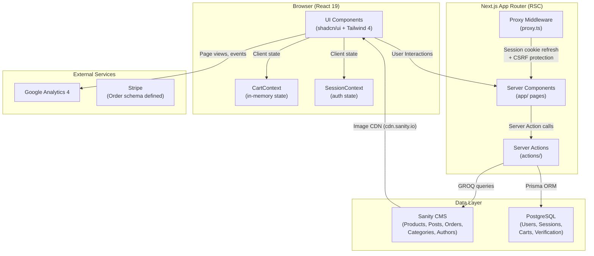
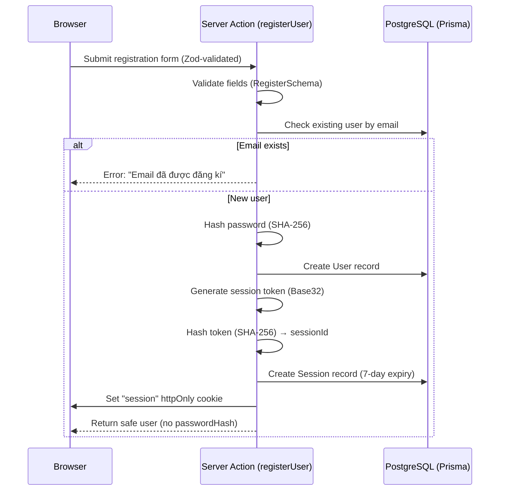
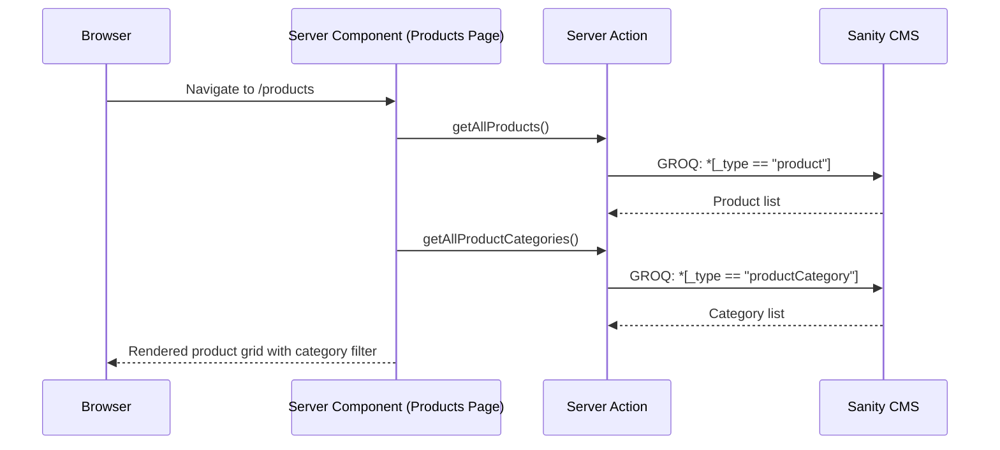
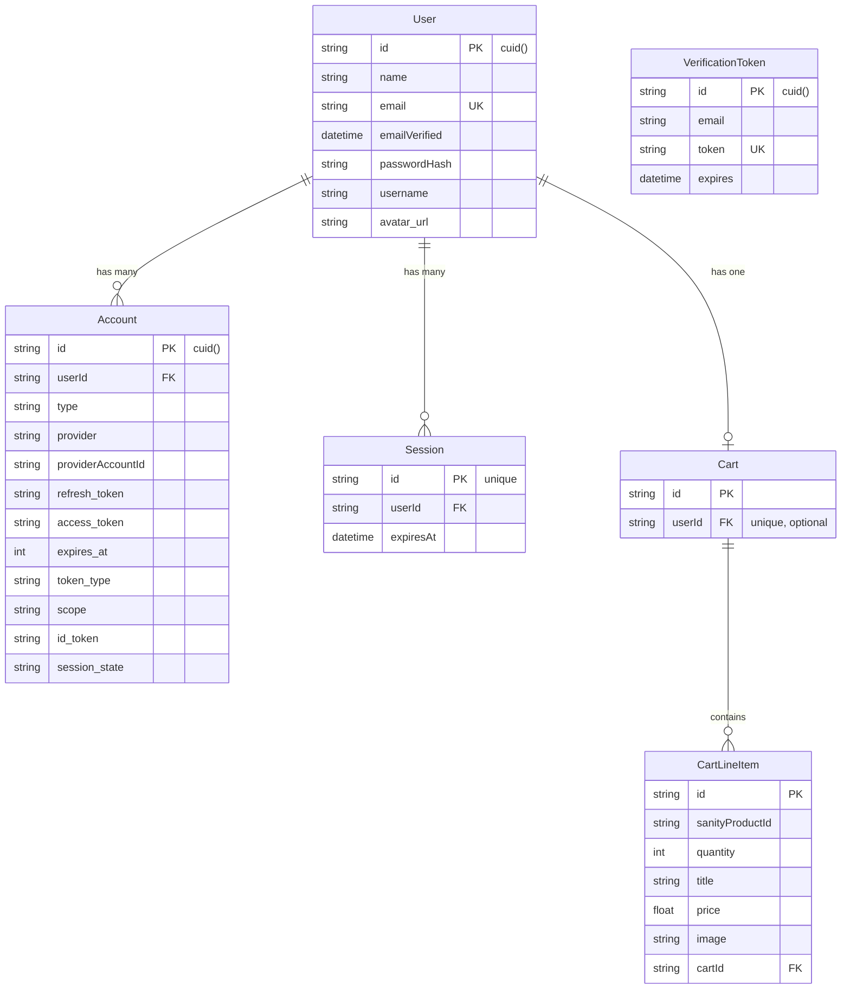

# TrekNice Related Website — Technical Documentation

> **System Architecture & Developer Guide**
> Generated from exhaustive codebase analysis — zero assumptions, every section grounded in actual source code.

---

## 1. Project Overview & Purpose

### What the System Does

**TrekNice** is a Vietnamese-focused **trekking & outdoor gear e-commerce platform** built as a **pnpm monorepo** powered by **Turborepo**. It provides:

- A **full-featured e-commerce storefront** (product catalog, cart, checkout, blog, authentication)
- A **marketing landing page** (hero, featured products, newsletter, CTA)
- A **documentation app** (Turborepo-scaffolded Next.js docs stub)

The platform targets the Vietnamese outdoor/adventure market ("Trang bị cho trekking và đi phượt" — Equipment for trekking and touring). Products are managed via **Sanity CMS**, user authentication and cart persistence use **PostgreSQL via Prisma**, and analytics are tracked via **Google Analytics 4**.

### Tech Stack Breakdown

| Layer                        | Technology                                                  | Version                                      |
| ---------------------------- | ----------------------------------------------------------- | -------------------------------------------- |
| **Framework**                | Next.js (App Router, RSC)                                   | 16.1.4 (e-commerce, landing) / 16.2.6 (docs) |
| **Language**                 | TypeScript                                                  | 5.9.2 – 6.x                                  |
| **Monorepo**                 | Turborepo + pnpm Workspaces                                 | turbo 2.9.14, pnpm 10.23.0                   |
| **UI Library**               | React 19                                                    | 19.2.6                                       |
| **Styling**                  | Tailwind CSS 4 + shadcn/ui (New York)                       | v4                                           |
| **Animation**                | Framer Motion                                               | ^12.34.3                                     |
| **CMS**                      | Sanity v4 (embedded Studio at `/studio`)                    | 4.22.0                                       |
| **Database**                 | PostgreSQL (via Prisma ORM + `@prisma/adapter-pg`)          | Prisma 7.x                                   |
| **Auth**                     | Custom session-based (Oslo crypto, SHA-256 hashed sessions) | —                                            |
| **State Management**         | React Context (Cart, Session) + Zustand (cart store stub)   | Zustand 5.0.10                               |
| **Forms**                    | React Hook Form + Zod validation                            | RHF 7.71, Zod 3.25+                          |
| **UI Primitives**            | Radix UI, Lucide icons, Sonner toast, Vaul drawer           | —                                            |
| **Payment** (schema defined) | Stripe (order schema has Stripe fields)                     | —                                            |
| **Analytics**                | Google Analytics 4 (`G-CDHJK3E1XW`)                         | —                                            |
| **Password Strength**        | zxcvbn-ts                                                   | 3.0.4                                        |
| **CI/CD**                    | GitHub Actions (4 workflows) + Dependabot                   | —                                            |
| **Google Verification**      | Search Console verification file in public                  | —                                            |

---

## 2. Directory & Module Structure

```
treknice_related_website/
├── .github/
│   ├── dependabot.yml                    # Automated dependency updates
│   └── workflows/
│       ├── ci.yml                        # Build pipeline (main/develop + PRs)
│       ├── lint.yml                      # Linting on PRs
│       ├── type-check.yml               # Type checking on PRs
│       └── backup.yml                   # Nightly Sanity dataset export
├── .vscode/
│   └── settings.json                    # ESLint workspace mode config
├── apps/
│   ├── treknice-e-commerce/             # 🛒 Primary e-commerce application
│   │   ├── actions/                     # Next.js Server Actions
│   │   │   ├── auth.ts                  # Session mgmt, register, login, logout
│   │   │   ├── cart-action.ts           # Cart CRUD (currently commented out)
│   │   │   ├── product.ts              # Product queries (Sanity GROQ)
│   │   │   ├── productCategory.ts      # Product category queries
│   │   │   ├── post.ts                 # Blog post queries
│   │   │   ├── postCategory.ts         # Blog category queries
│   │   │   ├── author.ts              # Author lookup
│   │   │   └── sizeProductVariant.ts   # Size variant lookup
│   │   ├── app/                        # Next.js App Router pages
│   │   │   ├── layout.tsx              # Root layout (SessionProvider, CartProvider)
│   │   │   ├── page.tsx                # Home (top-selling products)
│   │   │   ├── not-found.tsx           # Custom 404 page (Vietnamese)
│   │   │   ├── globals.css             # Tailwind 4 + shadcn CSS variables
│   │   │   ├── auth/sign-in/           # Sign-in page
│   │   │   ├── auth/sign-up/           # Sign-up page
│   │   │   ├── products/              # Product listing
│   │   │   ├── products/[slug]/       # Product detail (dynamic route)
│   │   │   ├── blog/                  # Blog listing & detail
│   │   │   ├── cart/                  # Shopping cart page
│   │   │   ├── checkout/             # Checkout flow
│   │   │   ├── about/                # About page
│   │   │   ├── contact/              # Contact page
│   │   │   ├── faq/                  # FAQ page
│   │   │   ├── shipping/             # Shipping policy page
│   │   │   ├── privacy/              # Privacy policy page
│   │   │   ├── terms/                # Terms of service page
│   │   │   ├── sustainability/       # Sustainability page
│   │   │   └── studio/[[...tool]]/   # Embedded Sanity Studio
│   │   ├── components/               # React components
│   │   │   ├── ui/                   # 24 shadcn/ui primitives
│   │   │   ├── layout/               # Header, Footer, UserAction
│   │   │   ├── home/                 # Hero, BestSeller, Featured, etc.
│   │   │   ├── product/              # ProductCard, ProductDetail, Products list
│   │   │   ├── cart/                  # Cart component
│   │   │   ├── checkout/             # Checkout component
│   │   │   ├── blog/                 # Blog, BlogCard, BlogDetail
│   │   │   ├── auth/                 # SignIn/SignUp forms, FormError/Success
│   │   │   ├── contact/              # Contact form
│   │   │   ├── about/                # About page component
│   │   │   ├── shipping-policy/      # Shipping policy component
│   │   │   └── sustainability/       # Sustainability component
│   │   ├── contexts/                 # React Context providers
│   │   │   ├── cart-context.tsx       # Cart state (in-memory, client-side)
│   │   │   └── session-context.tsx   # Auth session provider
│   │   ├── data/                     # Static seed/mock data
│   │   │   ├── products.ts           # 6 sample products
│   │   │   └── blog.ts              # 3 sample blog posts
│   │   ├── lib/                      # Utility & client setup
│   │   │   ├── prisma.ts             # PrismaClient singleton (PG adapter)
│   │   │   ├── sanity.ts             # Sanity client + image URL builder
│   │   │   ├── utils.ts              # cn() helper (clsx + tailwind-merge)
│   │   │   ├── umami.ts              # Umami analytics (empty)
│   │   │   └── generated/            # Prisma generated client output
│   │   ├── prisma/
│   │   │   ├── schema.prisma         # Database schema (5 models)
│   │   │   └── migrations/           # Single init migration
│   │   ├── sanity/
│   │   │   ├── env.ts                # Sanity project/dataset constants
│   │   │   ├── structure.ts          # Studio desk structure
│   │   │   ├── lib/                  # Sanity client, image, live helpers
│   │   │   └── schemaTypes/          # 11 Sanity document/object types
│   │   ├── schemas/
│   │   │   └── index.ts              # Zod validation (Login, Register)
│   │   ├── stores/
│   │   │   └── cart-store.ts         # Zustand store (empty/stub)
│   │   ├── routes.ts                 # Route definitions (public, auth, API)
│   │   ├── proxy.ts                  # Middleware: session refresh + CSRF
│   │   ├── sanity.config.ts          # Sanity Studio config (mounted at /studio)
│   │   ├── sanity.cli.ts             # Sanity CLI config
│   │   ├── prisma.config.ts          # Prisma config
│   │   ├── components.json           # shadcn/ui config (new-york style)
│   │   └── .env.example              # Environment variable template
│   ├── treknice-landing-page/        # 🏔️ Marketing landing page
│   │   ├── app/
│   │   │   ├── layout.tsx            # Layout (Inter font, GA4, full SEO metadata)
│   │   │   ├── page.tsx              # Home (Hero → Products → CTA → Newsletter)
│   │   │   └── globals.css           # Tailwind 4 styles
│   │   ├── actions/
│   │   │   ├── newsletter.ts         # File-based newsletter subscription
│   │   │   └── tracking_count_click.ts # File-based click tracking
│   │   ├── components/               # 15 components + UI directory
│   │   │   ├── hero-section.tsx
│   │   │   ├── featured-products.tsx
│   │   │   ├── collection-strip.tsx
│   │   │   ├── materials-section.tsx
│   │   │   ├── newsletter-section.tsx
│   │   │   ├── cta.tsx
│   │   │   ├── header.tsx / footer.tsx
│   │   │   ├── product-card.tsx / quick-look-modal.tsx
│   │   │   ├── animated-text.tsx / blur-panel.tsx / reveal.tsx
│   │   │   ├── parallax-image.tsx
│   │   │   ├── theme-provider.tsx
│   │   │   └── ui/                   # shadcn/ui primitives
│   │   ├── data/ / lib/ / styles/
│   │   └── components.json
│   └── docs/                         # 📖 Documentation app (Turborepo default)
│       ├── app/
│       ├── package.json              # Uses @repo/ui workspace package
│       └── public/
├── packages/
│   ├── ui/                           # @repo/ui — Shared React component library
│   │   └── src/
│   │       ├── button.tsx
│   │       ├── card.tsx
│   │       └── code.tsx
│   ├── eslint-config/                # @repo/eslint-config — Shared ESLint configs
│   │   ├── base.js
│   │   ├── next.js
│   │   └── react-internal.js
│   └── typescript-config/            # @repo/typescript-config — Shared TSConfigs
│       ├── base.json
│       ├── nextjs.json
│       └── react-library.json
├── package.json                      # Root workspace scripts
├── pnpm-workspace.yaml               # Workspace definition
├── turbo.json                        # Turborepo task pipeline
└── .gitignore
```

### Functional Description of Major Directories

| Directory                     | Purpose                                                                                                                    |
| ----------------------------- | -------------------------------------------------------------------------------------------------------------------------- |
| `apps/treknice-e-commerce/`   | Core e-commerce application: product browsing, authentication, cart management, blog, Sanity CMS integration, and checkout |
| `apps/treknice-landing-page/` | Standalone marketing/landing page with animated sections, newsletter subscription, and click tracking                      |
| `apps/docs/`                  | Turborepo-scaffolded documentation app (minimal, uses shared `@repo/ui` package)                                           |
| `packages/ui/`                | Shared React component library (`Button`, `Card`, `Code`) consumed by `docs`                                               |
| `packages/eslint-config/`     | Shared ESLint configurations for Next.js and React internal packages                                                       |
| `packages/typescript-config/` | Shared TypeScript base, Next.js, and React library configurations                                                          |
| `.github/workflows/`          | CI/CD: build, lint, type-check, and nightly Sanity backup                                                                  |

---

## 3. System Architecture & Data Flow

### Architectural Pattern

The project uses a **Monorepo Modular Architecture** with the following patterns:

- **Turborepo** for build orchestration and task caching across workspaces
- **Next.js App Router** with React Server Components (RSC) for each frontend app
- **Dual-CMS data layer**: Sanity (headless CMS for products/blog) + PostgreSQL/Prisma (users/auth/cart)
- **Server Actions** (`"use server"`) for all data-fetching and mutations — no REST/GraphQL API layer
- **GROQ queries** (Sanity) for content retrieval; Prisma ORM for relational data

### End-to-End Data Flow



### Core Business Workflows

#### 1. User Registration Flow



#### 2. Product Browsing Flow



#### 3. Cart Management (Client-Side)

The cart is managed entirely in-memory via React Context (`CartContext`). Cart items include the Sanity product object, quantity, and selected color/size variants. The server-side Prisma-backed cart logic exists in `cart-action.ts` but is **entirely commented out**, indicating a planned migration to persistent cart storage.

---

## 4. Data Models & Database Schema

### PostgreSQL (Prisma) — Relational Data

Defined in `prisma/schema.prisma`:



### Sanity CMS — Content Models

Defined in `sanity/schemaTypes/`:

| Document Type           | Key Fields                                                                                                                                                                                                         | Relationships                                                                                                 |
| ----------------------- | ------------------------------------------------------------------------------------------------------------------------------------------------------------------------------------------------------------------ | ------------------------------------------------------------------------------------------------------------- |
| **product**             | `name`, `slug`, `price`, `num_inventory`, `views`, `num_sold`, `discountPercents`, `mainImage`, `otherImages`, `descriptionProduct`, `warrantyProduct`, `swapProduct`, `publishedAt`, `subDescription`             | → `productCategory[]` (many-to-many via ref), → `sizeProductVariant[]` (refs), embeds `colorProductVariant[]` |
| **productCategory**     | `title`, `slug`, `description`                                                                                                                                                                                     | Referenced by `product`                                                                                       |
| **sizeProductVariant**  | `size` (string)                                                                                                                                                                                                    | Referenced by `product.sizes`                                                                                 |
| **colorProductVariant** | `colors`, `colorHex`                                                                                                                                                                                               | Embedded object in `product.colors`                                                                           |
| **order**               | `orderNumber`, `orderDate`, `customerId`, `customerName`, `customerEmail`, `stripeCustomerId`, `stripeCheckoutSessionId`, `stripePaymentIntentId`, `totalPrice`, `status` (PROCESSING/SHIPPED/DELIVERED/CANCELLED) | embeds `shippingAddress`, embeds `orderItem[]`                                                                |
| **orderItem**           | `quantity`, `price`                                                                                                                                                                                                | → `product` (reference)                                                                                       |
| **shippingAddress**     | `name`, `line1`, `line2`, `city`, `state`, `postalCode`, `country`                                                                                                                                                 | Embedded in `order`                                                                                           |
| **post**                | `title`, `slug`, `subDescription`, `timeRead`, `mainImage`, `body`, `publishedAt`                                                                                                                                  | → `author` (ref), → `category[]` (refs)                                                                       |
| **category**            | `title`, `slug`, `description`                                                                                                                                                                                     | Referenced by `post`                                                                                          |
| **author**              | `name`, `slug`, `image`, `bio`                                                                                                                                                                                     | Referenced by `post`                                                                                          |
| **blockContent**        | Rich text (headings, lists, images, links)                                                                                                                                                                         | Reusable block type                                                                                           |

---

## 5. Core APIs, Routes & Authentication

### Route Architecture

The e-commerce app uses **Next.js Server Actions** exclusively — there are no traditional REST API endpoints. All data operations are performed via `"use server"` functions.

#### Public Page Routes

| Route                 | Description                          | Data Source         |
| --------------------- | ------------------------------------ | ------------------- |
| `/`                   | Home page (top-selling products)     | Sanity (GROQ)       |
| `/products`           | Product listing with category filter | Sanity (GROQ)       |
| `/products/[slug]`    | Product detail page                  | Sanity (GROQ)       |
| `/blog`               | Blog listing                         | Sanity (GROQ)       |
| `/cart`               | Shopping cart                        | Client-side Context |
| `/checkout`           | Checkout flow                        | Client-side Context |
| `/about`              | About page                           | Static content      |
| `/contact`            | Contact page                         | Static content      |
| `/faq`                | FAQ page                             | Static content      |
| `/shipping`           | Shipping policy                      | Static content      |
| `/privacy`            | Privacy policy                       | Static content      |
| `/terms`              | Terms of service                     | Static content      |
| `/sustainability`     | Sustainability page                  | Static content      |
| `/studio/[[...tool]]` | Embedded Sanity Studio               | Sanity              |

#### Authentication Routes

| Route           | Description       |
| --------------- | ----------------- |
| `/auth/sign-in` | User login        |
| `/auth/sign-up` | User registration |

### Server Actions Summary

| Action Function               | Module                          | Summary                                              |
| ----------------------------- | ------------------------------- | ---------------------------------------------------- |
| `registerUser(values)`        | `actions/auth.ts`               | Register new user, hash password, create session     |
| `loginUser(values)`           | `actions/auth.ts`               | Authenticate, verify password, create session        |
| `logoutUser()`                | `actions/auth.ts`               | Invalidate session, delete cookie                    |
| `getCurrentSession()`         | `actions/auth.ts`               | Read session from cookie (cached with `react.cache`) |
| `validateSessionToken(token)` | `actions/auth.ts`               | Validate + auto-extend session if nearing expiry     |
| `getAllProducts()`            | `actions/product.ts`            | Fetch all products from Sanity                       |
| `searchProducts(query)`       | `actions/product.ts`            | Full-text product search via GROQ                    |
| `getProductById(id)`          | `actions/product.ts`            | Single product lookup                                |
| `getTopSellingProducts()`     | `actions/product.ts`            | Top 3 products by `num_sold desc`                    |
| `getAllProductCategories()`   | `actions/productCategory.ts`    | Fetch all product categories                         |
| `getCategoryBySlug(slug)`     | `actions/productCategory.ts`    | Category by slug                                     |
| `getCategoryNameById(id)`     | `actions/productCategory.ts`    | Category name/slug by ID                             |
| `getAllPosts()`               | `actions/post.ts`               | Fetch all blog posts                                 |
| `getPostById(id)`             | `actions/post.ts`               | Post by ID                                           |
| `getPostBySlug(slug)`         | `actions/post.ts`               | Post by slug                                         |
| `getAuthorById(id)`           | `actions/author.ts`             | Author by ID                                         |
| `getCategoryPostNameById(id)` | `actions/postCategory.ts`       | Blog category by ID                                  |
| `getSizeById(id)`             | `actions/sizeProductVariant.ts` | Size variant by ID                                   |

#### Landing Page Server Actions

| Action Function                | Module                            | Summary                                              |
| ------------------------------ | --------------------------------- | ---------------------------------------------------- |
| `subscribeToNewsletter(email)` | `actions/newsletter.ts`           | File-based newsletter subscription (JSON file)       |
| `increaseClick(type)`          | `actions/tracking_count_click.ts` | File-based click counter (`buy_now`, `view_product`) |

### Authentication & Security

| Aspect                | Implementation                                                                  |
| --------------------- | ------------------------------------------------------------------------------- |
| **Strategy**          | Custom session-based authentication (no NextAuth/Auth.js)                       |
| **Password Hashing**  | SHA-256 via `@oslojs/crypto` (⚠️ see Technical Debt)                            |
| **Session Token**     | 20 random bytes → Base32 encoded → SHA-256 hashed for storage                   |
| **Session Storage**   | PostgreSQL `Session` table via Prisma                                           |
| **Session Lifetime**  | 7 days (auto-extended to 30 days when < 15 days remaining)                      |
| **Cookie**            | `session`, httpOnly, sameSite: lax, secure in production                        |
| **CSRF Protection**   | Origin/Host header validation in `proxy.ts` middleware                          |
| **Session Refresh**   | Cookie expiration extended on every GET request                                 |
| **Validation**        | Zod schemas (`schemas/index.ts`): email, password (min 6 chars), name, username |
| **Password Strength** | `@zxcvbn-ts/core` available (dependency installed)                              |

### Route Protection Definitions

Defined in `routes.ts`:

- **Public routes**: `/`, `/auth/new-verification`, `/blog`, `/services`, `/customer-feedback-dashboard`, `/contact`, `/projects`, `/domain-space`, `/events`, `/studio`
- **Auth routes** (redirect logged-in users): `/auth/sign-in`, `/auth/sign-up`, `/auth/reset`
- **API auth prefix**: `/api/auth`
- **Default login redirect**: `/`

---

## 6. Local Development Setup

### Prerequisites

| Requirement    | Version                                                |
| -------------- | ------------------------------------------------------ |
| Node.js        | ≥ 18 (CI uses Node 20)                                 |
| pnpm           | 10.23.0 (declared in `packageManager`)                 |
| PostgreSQL     | Any compatible version (connection via `DATABASE_URL`) |
| Sanity account | Required for CMS content                               |

### Environment Variables

Based on `.env.example` and code analysis:

| Variable                             | Required     | Description                                             |
| ------------------------------------ | ------------ | ------------------------------------------------------- |
| `NEXT_PUBLIC_SANITY_PROJECT_ID`      | Yes          | Sanity project ID (hardcoded fallback: `vz9qs0sm`)      |
| `NEXT_PUBLIC_SANITY_DATASET`         | Yes          | Sanity dataset name (hardcoded fallback: `production`)  |
| `SANITY_API_READ_TOKEN`              | Yes          | Sanity API read token                                   |
| `NEXT_PUBLIC_SANITY_API_WRITE_TOKEN` | Yes          | Sanity API write token (used in `lib/sanity.ts` client) |
| `NEXT_PUBLIC_SANITY_API_VERSION`     | No           | Sanity API version (fallback: `2026-01-09`)             |
| `NEXT_PUBLIC_BASE_URL`               | No           | Base URL (default: `http://localhost:3000`)             |
| `STRIPE_SECRET_KEY`                  | For payments | Stripe secret key                                       |
| `STRIPE_WEBHOOK_SECRET`              | For payments | Stripe webhook secret                                   |
| `DATABASE_URL`                       | Yes          | PostgreSQL connection string                            |

### Step-by-Step Setup

```bash
# 1. Clone the repository
git clone https://github.com/baohuy2209/treknice_related_website.git
cd treknice_related_website

# 2. Install dependencies (pnpm will be auto-installed if using corepack)
corepack enable
pnpm install

# 3. Set up environment variables for e-commerce app
cp apps/treknice-e-commerce/.env.example apps/treknice-e-commerce/.env
# Edit .env with your Sanity and PostgreSQL credentials

# 4. Generate Prisma client
cd apps/treknice-e-commerce
pnpm db:generate

# 5. Push database schema (or run migrations)
pnpm db:push
# Or: pnpm db:migrate

# 6. Return to root and start all dev servers
cd ../..
pnpm dev
```

### Available Scripts

#### Root Workspace

| Script        | Command                               | Description                |
| ------------- | ------------------------------------- | -------------------------- |
| `dev`         | `turbo run dev`                       | Start all apps in parallel |
| `build`       | `turbo run build`                     | Build all apps             |
| `lint`        | `turbo run lint`                      | Lint all apps              |
| `format`      | `prettier --write "**/*.{ts,tsx,md}"` | Format all files           |
| `check-types` | `turbo run check-types`               | Type-check all apps        |

#### E-Commerce App

| Script               | Command                          | Description                      |
| -------------------- | -------------------------------- | -------------------------------- |
| `dev`                | `next dev`                       | Start dev server (port 3000)     |
| `db:push`            | `prisma db push`                 | Push schema to database          |
| `db:generate`        | `prisma generate`                | Generate Prisma client           |
| `db:studio`          | `prisma studio`                  | Open Prisma Studio GUI           |
| `db:pull`            | `prisma db pull`                 | Introspect database              |
| `db:migrate`         | `prisma migrate dev --name init` | Run migrations                   |
| `dev:sanity-studio`  | `sanity dev`                     | Start Sanity Studio locally      |
| `dev:sanity-deploy`  | `sanity deploy`                  | Deploy Sanity Studio             |
| `dev:sanity-schema`  | `sanity schema extract`          | Extract Sanity schema            |
| `dev:sanity-typegen` | `sanity typegen generate`        | Generate Sanity TypeScript types |

#### Landing Page App

| Script  | Command      |
| ------- | ------------ |
| `dev`   | `next dev`   |
| `build` | `next build` |
| `lint`  | `next lint`  |

#### Docs App

| Script | Command                |
| ------ | ---------------------- |
| `dev`  | `next dev --port 3001` |

---

## 7. Build, Deployment & CI/CD

### Build Configuration

- **Turborepo** orchestrates builds with dependency-aware task ordering (`"dependsOn": ["^build"]`)
- Build outputs: `.next/**` (excluding `.next/cache/**`)
- Environment files (`.env*`) are included as task inputs for proper cache invalidation
- `dev` tasks have caching disabled and run persistently

### CI/CD Pipelines

All workflows are defined in `.github/workflows/`:

#### CI Build (`ci.yml`)

- **Triggers**: Push to `main`/`develop`, all PRs
- **Steps**: Checkout → Setup pnpm → Setup Node 20 → Install (`--frozen-lockfile`) → Build all

#### Lint (`lint.yml`)

- **Triggers**: All PRs
- **Steps**: Checkout → Setup pnpm → Setup Node 20 → Install → `pnpm lint`

#### Type Check (`type-check.yml`)

- **Triggers**: All PRs
- **Steps**: Checkout → Setup pnpm → Setup Node 20 → Install → `pnpm typecheck`

#### Sanity Backup (`backup.yml`)

- **Triggers**: Cron schedule (`0 2 * * *` — daily at 2:00 AM UTC)
- **Steps**: Checkout → Install Sanity CLI → Export dataset to `.tar.gz` → Upload as GitHub artifact (3-day retention)
- **Requires**: `SANITY_AUTH_TOKEN` secret

### Dependabot Configuration

Defined in `dependabot.yml`:

- **npm ecosystem**: Weekly updates (Sunday 03:00), grouped by:
  - `next-core` (next, react, react-dom)
  - `ui-stack` (tailwindcss, postcss, radix-ui, lucide-react)
  - `tooling` (eslint, prettier, typescript, @types)
  - `dev-tools` (turbo, tsup, vite, webpack)
- **Ignores**: Major version bumps for `next`, `react`, `react-dom`
- **GitHub Actions ecosystem**: Weekly updates
- **PR limit**: 8 concurrent PRs
- **Labels**: `dependencies`, `bot`, `ci`

### Containerization

> **Note**: No `Dockerfile` or `docker-compose.yml` is present in the repository. The project is designed for direct Node.js deployment or platforms like Vercel.

### Remote Image Sources

The Next.js config in `next.config.ts` allows images from:

- `cdn.sanity.io` (Sanity CMS assets)
- `i.pinimg.com` (Pinterest)
- `images.unsplash.com` (Unsplash)

---

## 8. Key Business Logic & Technical Debt

### Critical Domain Logic

#### Custom Session Authentication (`actions/auth.ts`)

The authentication system is hand-rolled using Oslo cryptographic libraries:

1. **Token generation**: 20 random bytes → Base32 encoded (no-padding, lowercase)
2. **Session ID derivation**: Token → SHA-256 hash → hex-encoded (stored in DB)
3. **Session validation**: Cached via `react.cache()` to avoid redundant DB queries within a single request
4. **Auto-renewal**: Sessions within 15 days of expiry are automatically extended to 30 days
5. **CSRF protection**: Non-GET requests validate `Origin` header matches `Host` header

#### VND Currency Formatting (`sanity/schemaTypes/index.ts`)

A utility `formatVND()` function formats numbers in Vietnamese Dong (VND) currency format using `Intl.NumberFormat` with `vi-VN` locale. This is used in Sanity Studio preview subtitles for products.

#### Cart Context Architecture (`contexts/cart-context.tsx`)

The cart supports product variant selection (color + size) and calculates totals client-side. Key behaviors:

- Adding an existing product increments its quantity
- Setting quantity to 0 removes the item
- Total price is computed from `product.price * quantity`

### Identified Technical Debt

#### ⚠️ Password Hashing — Insecure Implementation

Passwords are hashed using plain SHA-256 (`@oslojs/crypto/sha2`) without salting or key-stretching. This is **cryptographically inadequate** for password storage. The verification function compares raw SHA-256 hashes directly.

**Recommendation**: Migrate to `argon2`, `bcrypt`, or `scrypt` with proper salting.

#### ⚠️ Cart Server Actions Entirely Commented Out

The entire `cart-action.ts` file (242 lines) is commented out. This includes `createCart`, `getOrCreateCart`, `updateCartItem`, `syncCartWithUser`, and `addWinningItemToCart`. The cart currently operates only in client-side memory via React Context, meaning **cart data is lost on page refresh**.

#### ⚠️ Sanity Backup Workflow Path Mismatch

The `backup.yml` workflow references `apps/client-stackra/backup.tar.gz` in the upload artifact step, but the actual app directory is `apps/treknice-e-commerce`. This workflow will fail on the artifact upload step.

#### ⚠️ Console.log in Session Creation

`actions/auth.ts` line 25 logs the raw session token to the console: `console.log(token)`. This is a **security concern** in production.

#### Zustand Store Stub

`stores/cart-store.ts` exists but is empty. Zustand (`^5.0.10`) is installed as a dependency. This suggests a planned migration from React Context to Zustand for cart state management.

#### Umami Analytics Stub

`lib/umami.ts` exists but is empty. This may indicate a planned Umami analytics integration alongside Google Analytics.

#### Landing Page File-Based Data Storage

The landing page's newsletter subscription and click tracking use direct filesystem I/O (`fs.writeFileSync`) to JSON files. This is not production-safe for serverless deployments (e.g., Vercel) where the filesystem is ephemeral.

#### OAuth Account Model Present But Unused

The Prisma schema includes a full `Account` model compatible with `@auth/prisma-adapter` (OAuth provider fields), and the dependency is installed. However, no OAuth provider configuration exists — only email/password authentication is implemented.

#### Route Definitions Reference Non-Existent Pages

The `routes.ts` public routes list includes `/services`, `/customer-feedback-dashboard`, `/projects`, `/domain-space`, and `/events` — none of which have corresponding page directories in the `app/` folder. The `/auth/reset` route also lacks an implementation.

#### Static Data Files Alongside CMS

The `data/products.ts` and `data/blog.ts` files contain hardcoded sample data (6 products, 3 blog posts). The actual product and blog pages fetch from Sanity CMS. These files may serve as development fallback data but create a maintenance divergence.

#### Stripe Integration Not Wired

The `STRIPE_SECRET_KEY` and `STRIPE_WEBHOOK_SECRET` environment variables are defined, and the `order` Sanity schema includes Stripe-specific fields (`stripeCustomerId`, `stripeCheckoutSessionId`, `stripePaymentIntentId`). However, no Stripe SDK is installed and no payment processing code exists. This represents planned but unimplemented payment integration.

---

> **Document generated**: 2026-08-21 | **Author**: Nguyen Bao Huy | **Codebase**: `baohuy2209/treknice_related_website`
